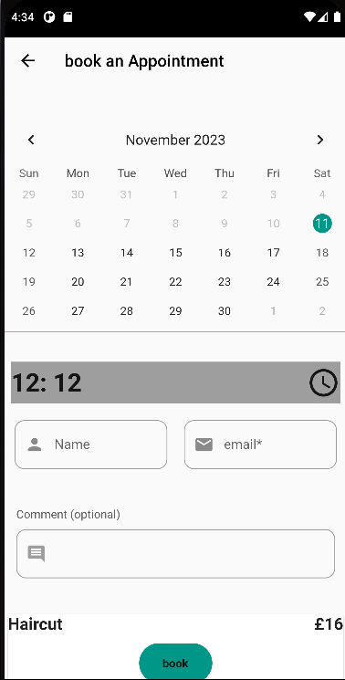

# Barber Booking App

This Flutter application is designed to facilitate appointment booking for a barber shop. It provides customers with a user-friendly interface to book appointments via a calendar, view the barber's recent works through an image gallery, and receive notifications about specials and promotions.

## Features:
- **Appointment Booking**: Customers can easily schedule appointments through an interactive calendar interface.
- **Image Gallery**: The app showcases the barber's recent works through a visually appealing image gallery.
- **Admin Dashboard**: For the barber's convenience, an admin dashboard allows access to important information and appointment management.
- **User Authentication**: Customers can register and log in to the app, enabling personalized experiences and appointment management.
- **Notifications**: Customers receive notifications about specials and promotions, fostering customer engagement and retention.

## Why Flutter and Firebase?
- **Cross-Platform Development**: Flutter allows us to build a single codebase for both iOS and Android platforms, reducing development time and effort.
- **Fast Development**: Flutter's hot reload feature enables rapid iteration and testing, speeding up the development process.
- **Native Performance**: Flutter provides native performance on both iOS and Android platforms, ensuring smooth and responsive user experiences.
- **Rich UI**: Flutter offers a rich set of pre-built widgets and customizable UI components, enabling us to create visually stunning and engaging interfaces.
- **Firebase Integration**: Firebase provides a comprehensive backend solution, offering features such as authentication, real-time database, cloud storage, and cloud messaging.
- **Scalability**: Firebase's scalable infrastructure allows the application to handle a growing user base and increasing demand with ease.
- **Real-Time Updates**: Firebase's real-time database and cloud messaging capabilities enable instant updates and notifications, enhancing user engagement and experience.

By leveraging Flutter and Firebase, we aim to deliver a seamless and feature-rich experience for both customers and barbers, streamlining the appointment booking process and enhancing customer satisfaction.

## Screenshots:

